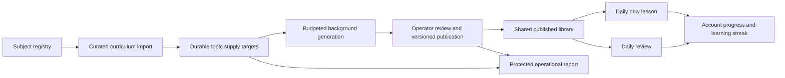

# Sustainable learning architecture

Issue #195 is delivered as one PR with focused commits. The current five subjects
remain the starting catalog. Subjects are database records, not application modes;
future additions and retirement use the same registry and content workflow.

## Boundaries and invariants

- Topic UUIDs and slugs remain stable. Retiring a topic hides it from discovery,
  new selection and generation without deleting concepts, follows or history.
- New assignments preserve one concept per user/day and no repeated new concept.
  Review has its own daily record; both completion types count learning days,
  while unique learned totals remain based on completed new assignments only.
- A profile row lock serializes daily selection and review selection. A review
  already chosen for today wins over content that arrives later that day.
- Legacy clients retain the existing daily payload. Review-aware clients opt in
  to a separate review payload; old clients never mistake a review for new learning.
- Publication is explicit operator work. Generation prepares drafts, not truth.
  Corrections use an optimistic base version and preserve the concept identity.
- New subjects need registry/curriculum data, not new routes or mobile screens.
  Topic retirement is reversible; physical deletion is not a routine operation.

## Supply and curriculum

The daily path only signals low availability. Durable topic targets are computed
from published content plus the reader's deficit, and merged with GREATEST. With
unchanged assignments, publication increases published and unseen counts equally,
so repeated requests do not increase the target. Scheduled planning accounts for
active readers from the last 90 days and bootstraps new subjects. Default target
reserve is 60 lessons; the low watermark is 5. These are configurable operating
choices, not a guarantee that approved material or provider capacity exists.

Generation claims are serialized per subject and count drafts toward work in
progress so an approval backlog cannot cause unlimited drafts. Every provider
call still reserves from the shared Pacific-day ledger. Daily reading never waits
for a model; stale work, empty curricula and exhausted budgets have bounded exits.

Curriculum imports are validated and idempotent. Stable slugs, objectives,
difficulty, prerequisite slugs and references keep expansion deliberate. Similar
titles are surfaced for operator review. Import, correction, review, publication
and retirement are maintainer CLI actions; they are not public mobile API powers.

## Review and offline behaviour

An exhausted review-aware reader receives a previously completed lesson chosen
by least recent review. Explicit completion may keep the learning streak alive,
but never increases the unique learned count. Server dates and the existing
one-day grace determine accepted completion. A completion identifies its review
record, so a stale offline request cannot complete a different day's activity.

The review payload travels in the existing account cache. Pending completion uses
the durable outbox and existing reconnect scheduler. New account-scoped state is
cleared on sign-out and guarded against late responses. The UI distinguishes
Review from New, and offers subject discovery or a retry when no review exists.

## Delivery plan

1. Reproduce the refill stop; introduce durable supply planning and concurrency tests.
2. Add generic subject lifecycle and structured curriculum import.
3. Add versioned drafts, explicit review/publication and safe corrections.
4. Add review selection/completion and activity-based streaks with compatibility tests.
5. Add account-safe offline review and Today UI.
6. Add protected operational reports, condition transitions and maintenance runbook.
7. Validate long-running supply, retirement/addition, outages and full regressions;
   document the complete architecture and open one PR into develop.

New migrations must be applied before backend deployment. Their filenames stay
out of applied.txt until production application is verified. This PR does not
change production settings, generate live content or deploy a release.
