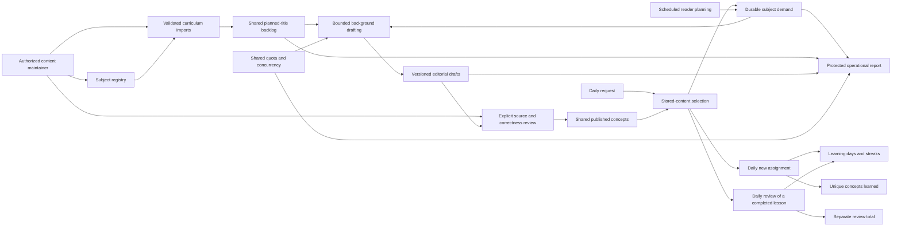

# Sustainable learning architecture

One shared library supports a continuing daily learning habit. The existing five
subjects remain the initial registry. Future subjects use the same data contracts
and operations, without adding subject-specific routes or screens. #195 is one
implementation PR targeting `develop`; it does not deploy a production release.

## Components and ownership

The FastAPI backend owns application writes and verifies JWT identity. The mobile
app reads the API and stores account-scoped caches/intents. Model credentials and
operator access remain on the backend. Curriculum import, approval and operational
reports use a maintainer CLI rather than exposing administrative routes to users.

| Layer | Main implementation | Durable identity |
| --- | --- | --- |
| Registry and curriculum | `curriculum.py`, `content/subjects.json` | Topic UUID + immutable slug; planned concept slug |
| Demand and generation | `supply.py`, `pool.py`, `prefetch.py`, `generation_budget.py` | One demand target per topic; backlog UUID |
| Editorial changes | `publication.py`, `concept_revisions` | Concept UUID/slug + monotonically increasing content version |
| Daily activity | `selection.py`, `reviews.py`, `interactions.py` | New assignment or review UUID + server local date |
| Mobile persistence | `remoteProgressRepository.ts`, `mutationOutbox.ts` | Account epoch; review UUID for replay |
| Operations | `content_health.py`, `workers/content.py`, `workers/pool_topup.py` | Condition key and worker name |

Paths in the table refer to `backend/app/services/` unless qualified; the mobile
files live in `mobile/src/services/`. See [the codebase map](CODEBASE_MAP.md) for
routes and [the operations runbook](CONTENT_OPERATIONS.md) for commands.

## Continuous supply without per-user generation

For subject `t` and reader `u`:

- `P(t)` = published concepts in the active subject.
- `A(u,t)` = those published concepts already assigned to that reader, including skipped assignments.
- `U(u,t) = P(t) − A(u,t)` = unseen supply, matching daily eligibility.
- When `U` reaches the low watermark, requested shared inventory is `A + reserve`.

Requests coalesce into one row using the maximum target. With no additional
assignments, publishing one lesson increases `P` and `U` together; the target
stays fixed. Repeated opens, multiple devices and multiple users do not create
independent catalogs or ever-increasing targets. The target advances with actual
consumption. Demand commits **before** a background task is woken; otherwise a
second session can see the old bootstrap floor and wrongly stop at 25 lessons.

Scheduled planning aggregates the most experienced active reader in each followed
subject. Active means an assignment or review was created within the configured
90-day window. Demand expires without continued activity; the 25-lesson bootstrap
floor remains available for subjects without active demand. Existing greater
unexpired targets are retained so a concurrent planner cannot overwrite a reader
signal. Inactive old targets are not grounds for deleting approved content.

Default reserve is 60, urgent watermark 5, and a normal pass attempts at most five
items per subject. These settings are operating choices. The planner cannot
manufacture an approved curriculum or a human review schedule. Empty curricula,
low reserves and approval backlogs must remain visible instead of being hidden
behind a larger fixed global pool.

## Generation and publication transactions

A normal generator locks the topic for a short capacity check, counts published
concepts, drafts and in-flight work, and claims one eligible backlog item with
`FOR UPDATE SKIP LOCKED`. A model call is reserved from the existing Pacific-day
usage ledger in that transaction. A shared transaction advisory lock serializes
the provider-slot check across the midnight budget-row change as well. The
transaction commits before provider I/O; no database connection remains pinned
across model latency or backoff.

The global provider-slot default is three. Capacity denial rolls back an
**unstarted** claim and reservation. Failed, throttled or uncertain calls that
actually started retain their quota reservation. Throttling refunds the title's
attempt, not quota. Normal failures stop after three attempts; an operator can
grant one audited additional attempt after correcting the cause. Generation
switches apply to every worker entry point. Stale claims have a 30-minute recovery
window, comfortably beyond the provider request timeout.

Successful generation writes a **draft concept and draft revision atomically**.
It does not publish to readers. Drafts count toward capacity, so an approval
backlog cannot cause unlimited generation. The shared catalog stores a lesson
once, independently of the number of readers.

The maintainer validates an objective, difficulty, prerequisites and references,
then records a substantive review note. Publication checks the current base
version and updates the existing concept atomically. Repeating the same approved
revision returns its version without another publication. Competing corrections
cannot silently overwrite each other. Existing text remains visible during
review, and prior versions are retained. Legacy snapshots explicitly record
that their original review information was unavailable.

Bulk correction drafting also uses durable revision claims, daily quota and
provider slots. A second worker skips an in-progress/pending correction. A crash
leaves a recoverable claim, not an unreviewed replacement of live text.

## Portable subjects and deliberate curriculum growth

Topic UUIDs and slugs are stable identities; display names and ordering are data.
Imports upsert only the supplied subjects. Retirement sets `is_active=false`:
new discovery, assignment and generation stop, while saved/history links and
already chosen activities survive. Retirement is reversible; routine operations
never physically delete a subject or reassign its identity.

`curriculum.example.json` demonstrates adding plans for the existing five
subjects through data. Difficulty defines foundations (1), intermediate ideas
(2) and advanced applications (3). Objectives and prerequisite references are
validated; missing references and cycles are rejected. Exact title/objective
duplicates are rejected and title-similarity warnings surface likely overlaps.
This heuristic supplements editorial review; it cannot establish semantic novelty.

Prerequisites must be published before dependent content is approved. Within topic
rotation, selection prefers satisfied prerequisites and lower difficulty. They
are preferences rather than eligibility locks: skipped lessons still leave the
new-assignment pool under the existing no-repeat rule. Unseen supply therefore
uses the same eligibility rule as selection.

Only pending/failed plans can be explicitly revised; attempts and status are
preserved. Done or generating plans are not silently rewritten. Published
corrections use the versioned editorial workflow. No applied seed migration is
modified when the operator imports the next batch.

## Daily review and compatibility

The existing unique constraints still enforce one new concept per user/day and
no repeated new concept per user. Review has a separate durable table and
completion record; it never fabricates another new assignment.

Every selection locks the user's profile while deciding between activity types:

1. Return a review already chosen today, including its completion state.
2. Otherwise return an existing new assignment or select an unseen published lesson.
3. If the catalog is exhausted and the client opted in, choose a previously
   completed published lesson, preferring the least recently reviewed.
4. If no completed lesson exists, return honest exhaustion with exploration/retry UI.

Fresh publication during a review cannot replace the selected activity. A legacy
client requesting the same day sees its compatible exhausted response, not a
review disguised as a new lesson. Updated clients request
`GET /v1/me/state?compact=true&reviews=true`, which adds a separate `review`
payload while preserving `daily`. `POST /v1/reviews/{id}/complete` accepts no
client-selected user/date. Ownership comes from the verified JWT.

Completion normally counts for the review's server-local assigned day.
Yesterday is accepted only while no newer activity has been assigned. Older
uncompleted activity cannot repair a streak. A completed review can be safely
acknowledged again without changing its timestamp or day. Profile locking
serializes selection and both completion types across devices.

Streaks use the union of completed new-assignment and review dates. A day counts
once; opening a lesson counts nothing. `total_learned` continues to count unique
completed new assignments, and `total_reviews` counts completed review records.
Both state and standalone stats use these semantics. Reminders are suppressed
when either kind of activity completed the relevant day.

## Offline and correction behaviour

A review payload contains its full stored lesson and stable version. It uses the
existing account cache and concept cache. The outbox stores review completion
by review UUID, separately from new completion intents. It persists before
network I/O, coalesces repeated taps, retries offline/server failures and accepts
idempotent acknowledgements. A stale review intent cannot complete a different
activity. Optimistic review completion updates activity metrics without adding
a learned-history row; the server reconciles timezone/grace decisions.

The existing account epoch and serialized storage cleanup fence late callbacks
and clear review data during sign-out. There is no new native worker: syncing
runs while the existing APK is open or reopened. Offline content stays on its
cached version until fetched online; detail reads refresh corrected text using
the same slug, preserving saved/history references.

## Operational limits and rollout

The protected report exposes supply, drafts, queue failures, stale claims,
reservation usage and worker health without user identifiers or raw provider
errors. Shared condition state deduplicates transitions and records recovery;
the CLI's full snapshot remains the source for investigation. Hosting job logs
are the initial delivery surface, not a new email/notification integration.

Apply migrations 0011–0015 before backend deployment, then ship the JS update.
Their filenames remain out of the production ledger until actual application is
verified. Keep old generators stopped during rollout. Restore/pause procedures,
editorial responsibilities, publication cadence and remaining live-environment
checks are in [CONTENT_OPERATIONS.md](CONTENT_OPERATIONS.md).
