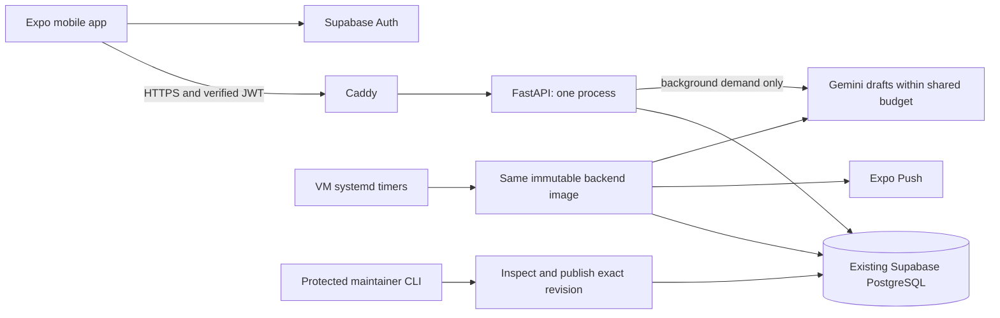
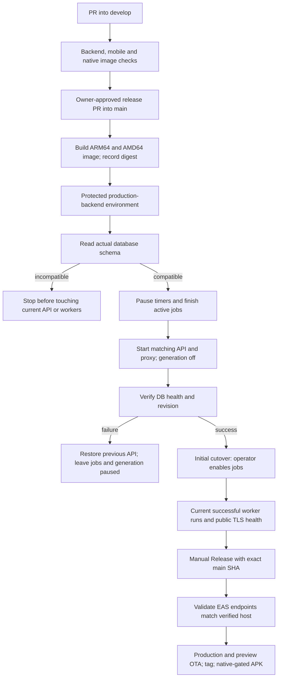

# Backend VM deployment and deferred cutover

This is the runbook for #169/#170. **Cloud provisioning and production cutover
are deferred by the owner.** The implementation PR stays draft. Nothing in the
PR establishes a running VM, a free account, working DNS, delivered push, or a
completed migration. Railway remains the current host until an approved cutover.

## Resume checklist for the owner

1. Finish account verification when funds are available. Confirm the actual free
   allowance, capacity, region and architecture before creating resources.
2. Supply a dedicated Ubuntu 24.04 VM and a stable HTTPS hostname you control.
   A free subdomain can work; this project does not require purchasing a domain.
3. Inventory Railway API, scheduled workers, variables and current bill privately.
   Record the Supabase region, production revision and rollback configuration.
4. Set up Docker, private host configuration, DNS, deployment access and the
   protected GitHub environment using the sections below.
5. Rehearse on an isolated database, then approve a separate release/cutover.
   Apply any pending migration, including `0016_achievements.sql`, and verify it.
6. Test old/new clients, recovery links and a controlled physical device. Observe
   at least 24 hours including the daily content cycle and a host reboot.
7. Only then decide whether to retire Railway. Its deletion, billing changes,
   PR merges and PR closures each retain the owner's approval requirements.

No money or cloud signup is needed to review this draft or run its local tests.

## Service placement and costs

| Service | Placement | Responsibility |
| --- | --- | --- |
| HTTPS API, recovery/confirmation pages | Ubuntu VM: Caddy → FastAPI | Authenticated application requests and database writes |
| Reminder, content supply and observation jobs | Same VM: systemd → short-lived containers | Schedule and supervise the exact deployed backend image |
| Database and identity | Existing Supabase project | PostgreSQL, accounts, JWT/JWKS, existing email provider/templates |
| Mobile bundle/build/update | Existing Expo/EAS project | Native app and explicitly published OTA updates |
| Push transport | Existing Expo Push service | Deliver submitted messages through Apple/Google push infrastructure |
| Generated drafts | Existing Gemini project | Shared capped calls, followed by human review |
| Code, checks, images, external health | GitHub Actions and GHCR | Test/build/deploy and detect loss of the VM |

Oracle Always Free remains the intended long-term option. The scripts are
portable across ARM64 and AMD64 Ubuntu VMs; AWS EC2 was discussed, but a switch
was not selected. AWS's current new-account Free plan lasts up to six months or
until its credits run out; it is not a permanently free EC2 replacement.
See [AWS Free Tier](https://aws.amazon.com/free/).

Verify Oracle's current terms in the account before provisioning. Its current
A1 allowance is 1,500 OCPU-hours and 9,000 GB-hours per month, equivalent to
2 OCPUs/12 GB continuously, plus the documented home-region storage allowance.
Capacity and signup are not guaranteed; idle eligible VMs can be reclaimed.
Use an eligible shape/boot volume and check the estimate is zero. Do not select
paid extras, upgrade the account or create synthetic load to evade reclamation.
[Oracle resource and reclamation rules](https://docs.oracle.com/en-us/iaas/Content/FreeTier/freetier_topic-Always_Free_Resources.htm).

The committed container limits assume at least 2 CPUs and 4 GB RAM; an eligible
2 CPU/12 GB A1 VM fits that profile. A 1 GB EC2 micro is not an equivalent host
for simultaneous API, proxy and jobs. Review capacity and price before changing
these limits. Choose an eligible region near the existing Supabase database;
record the latency/capacity tradeoff if home-region availability prevents that.

Standard GitHub-hosted runner use is free for this public repository, including
its supported ARM64 runners. Monitor uses that allowance; it is not a production
reminder scheduler. [GitHub runner reference](https://docs.github.com/en/actions/reference/runners/github-hosted-runners).
Keep the backend GHCR package public for anonymous pulls and review current
registry billing/retention before changing visibility. Container registry storage
and bandwidth are currently free under [GitHub's package billing policy](https://docs.github.com/en/billing/concepts/product-billing/github-packages).
Supabase, Gemini and EAS
retain their own quotas; moving the VM does not remove them. There can also be
Railway cost during the compatibility window. A zero final Railway bill must be
verified, not inferred from a successful deployment.

## Request, worker and release flow





`VM_DEPLOY_ENABLED` is unset/false until setup is complete. A manual **Backend
deploy** run on main is also available after approval. Both paths run application
quality before building. API and jobs use the same digest and `APP_REVISION`;
no live source checkout or mutable backend tag is used to run production.
A deployment alone never publishes a mobile update.

## One-time host preparation

Use a dedicated Ubuntu 24.04 host, patched through the normal OS procedure.
Record region, `uname -m`, eligible shape, disk size, IP and operator ownership.
Use key-based administrator SSH; disable password/root SSH login after verifying
an administrator session and recovery-console access.

Install Docker Engine and the Compose plugin following the
[official Ubuntu instructions](https://docs.docker.com/engine/install/ubuntu/).
Install Python 3, Git and sudo if absent. Do not put the deployment identity in
the Docker group: Docker access is effectively root access.

Cloud firewall and host firewall must allow inbound TCP 80/443 for Caddy. Leave
8000 and database ports private. Restrict administrator SSH to approved sources.
Docker-published ports interact with host firewall rules; verify externally
that only the intended services are reachable. Outbound access is needed for
DNS/NTP, GitHub/GHCR, TLS issuance, Supabase, Gemini and Expo.

**Deployment connectivity is an explicit setup decision.** Standard GitHub
runners have changing outbound addresses. An administrator-IP-only SSH rule
will block the deploy job. Establish an approved runner-to-host path before
enabling automatic deployment; do not blindly open all SSH or weaken host-key
checking. Until that path exists, an administrator can deploy the approved
SHA/digest manually from their allowed network. The automated Release gate also
requires this path, so mobile publication must remain deferred meanwhile.

Point the approved DNS A record to the VM's IPv4 address. Add AAAA only when IPv6
is actually reachable. No provider-specific DNS API key is required for Caddy's
normal HTTP challenge. Persist its data volume so reboots retain certificate
state. [Caddy automatic HTTPS](https://caddyserver.com/docs/automatic-https).

From a reviewed checkout at the approved deployment revision on the host:

```sh
sudo bash backend/operations/install.sh
```

This installs the controller, restricted deployment identity and systemd units;
it enables Docker and sets UTC/NTP. It does not deploy the app or enable workers.
Re-running bootstrap pauses jobs, so use it only deliberately during maintenance.
Runtime releases supply their own controller and units on subsequent deployments.

## Private runtime configuration

Create `/etc/one-concept/backend.env` from `backend/.env.example` and
`/etc/one-concept/host.env` from `backend/operations/host.env.example`.
Own both as root with mode `0600`; the directory is `0700`. Edit them on the host
or transfer through an approved private channel. Never paste values into GitHub,
issue comments, workflow logs, mobile configuration or chat.

| Setting | Source and purpose |
| --- | --- |
| `DATABASE_URL` | Existing Supabase transaction pooler, port 6543; API and worker queries |
| `DIRECT_URL` | Same project's session pooler, port 5432; read-only schema verification and deliberate migrations |
| `SUPABASE_URL`, `SUPABASE_JWKS_URL` | Same production Auth project and its signing keys |
| `SUPABASE_ANON_KEY` | Public project key used by the existing auth landing pages |
| `SUPABASE_SERVICE_ROLE_KEY`, legacy JWT secret | Preserve only if actually required by current operations; never expose to mobile |
| `GEMINI_API_KEY`, model and content settings | Existing provider; preserve the shared cap, pacing and review controls |
| `GENERATION_ENABLED` | Controller overrides this from protected host state; deployments start false |
| `ALLOWED_ORIGINS` | Exact approved web origins; native clients do not need permissive CORS |
| Read/write rate limits | Defaults 120 reads/minute and 60 writes/minute per verified account |
| `API_HOST`, `TLS_EMAIL` in host.env | Approved hostname and certificate contact |
| `CADDY_IMAGE` in host.env | Reviewed Caddy image pinned by real `@sha256:` digest |

For example, pull the reviewed Caddy release and inspect its real repo digest:

```sh
sudo docker pull caddy:2
sudo docker image inspect caddy:2 --format '{{index .RepoDigests 0}}'
```

Review the selected version, then store the resulting digest in `host.env`.
There is intentionally no invented digest committed here. The backend workflow
publishes its digest in the run summary; the controller verifies its image label
matches the requested full commit SHA. Runtime credentials never enter that image.

Expo Push continues using the existing mobile project/device credentials and
backend submission path. The migration does not introduce a new push API key.
SMTP configuration and branded templates stay in Supabase (#152/#171/#187).
No weekly email digest or new email sender is introduced.

## GitHub deployment credentials and branch rules

Create environment **production-backend**, restrict it to `main`, and require the
owner's deployment review. Do this before allowing workflows to use its secrets.
Store variables `DEPLOY_HOST`, `DEPLOY_PORT` (default 22), and `PUBLIC_API_ORIGIN`
(the HTTPS origin with no path). Store secrets `DEPLOY_SSH_KEY` and
`DEPLOY_KNOWN_HOSTS`. Existing `EXPO_TOKEN` remains the EAS credential.
Set repository `PUBLIC_API_ORIGIN` as well for the external health workflow.
Only set repository `VM_DEPLOY_ENABLED=true` after the cutover prerequisites.

Generate a separate Ed25519 deployment key. On the host install its **public**
key in `/home/one-concept-deploy/.ssh/authorized_keys`, owned by that user with
mode `0600`, with this prefix on the same line:

```text
restrict,command="sudo -n /usr/local/sbin/one-concept ssh \"$SSH_ORIGINAL_COMMAND\"" ssh-ed25519 REPLACE_WITH_PUBLIC_KEY
```

The forced command accepts only validated `deploy SHA IMAGE_DIGEST` and
`status SHA`. It cannot open a shell, forward ports, publish content, enable
initial schedules or enable generation. The controller/configuration are root
owned. Test that `ssh ... id` and an interactive shell are rejected.

Verify the host's SSH fingerprint independently through the provider console
or an existing trusted administrator session. Put the matching known-hosts line
in `DEPLOY_KNOWN_HOSTS`; a nonstandard port uses `[hostname]:port`. The workflow
uses strict checking and never trusts an unverified `ssh-keyscan` result.
The host anonymously pulls the public GHCR package; if a new package initially
starts private, make this code-only package public deliberately before deploying.
Do not solve a pull failure by putting a broad personal token on the VM.

Application CI runs on every PR without path filters or production credentials.
After the workflow lands on both protected branch baselines, add these exact
required checks to develop/main protection, preserving existing requirements:

- `Backend quality`
- `Mobile quality`
- `Backend image (amd64)`
- `Backend image (arm64)`

On 2026-09-25, the inspected develop protection had no required status checks and
no repository rulesets. A YAML file alone does not enforce merging policy.
Configure and verify enforcement as a rollout item; doing it before the workflow
exists on other PRs can strand those PRs waiting for checks. Retain the existing
main migration gate and review/conversation rules. This PR changes no branch
protection and enables no auto-merge.

## Schema and activation

`schema_check` uses the actual database, in a bounded read-only transaction.
It compares tables, columns, constraints, indexes, RLS/policies, signup triggers
and functions against `backend/schema/contract.json`. The contract includes
migration hashes and achievements. A copied `applied.txt` cannot make it pass.
It does not run migrations, seed users or change the production ledger.

Apply missing immutable SQL files deliberately in order, verify their effects,
then record them in `applied.txt`. `0016_achievements.sql` comes from #228; this
migration PR does not claim it has been applied to production. See
[release procedure](../RELEASING.md) and [achievements rollout](ACHIEVEMENTS.md).
If metadata differs across PostgreSQL versions, inspect the exact difference;
do not regenerate the contract from production to silence a failure. The
contract update test only constructs a disposable PostgreSQL 16 container.

After a reviewed release is on main, use **Backend deploy**, or from approved
administrator SSH:

```sh
sudo one-concept deploy FULL_MAIN_SHA ghcr.io/coding-moves/one-concept-backend@sha256:REAL_DIGEST
```

Initial activation leaves all application timers and generation off. Verify the
new HTTPS API, pages and auth with designated test accounts. Then disable old
Railway cron jobs **and old API demand generation**, wait for running jobs to
finish, and record evidence of exactly one scheduler owner. Only then:

```sh
sudo one-concept enable-jobs --old-schedulers-stopped
sudo one-concept run-job pool_topup
sudo one-concept run-job observe
sudo one-concept run-job reminders
sudo one-concept monitor
sudo one-concept status FULL_MAIN_SHA
```

These are real production commands: reminders can send currently due pushes.
Use them only in the approved cutover window, after isolated rehearsals. A
successful disabled-generation pool run proves entry-point/schema readiness,
not a real Gemini call. After code/worker compatibility and quota are verified,
`sudo one-concept generation on` enables the shared generation policy. Every
subsequent deployment pauses generation again; re-enable deliberately.

## Schedules, retries and editorial work

| Timer | UTC schedule | Missed-run behavior |
| --- | --- | --- |
| Reminders | Minute 00/15/30/45 | No catch-up on boot; next run examines only the existing 15-minute eligibility window |
| Pool top-up | Daily 04:00 | Persistent; missed run catches up once after boot |
| Content observation | Hourly :05 | Persistent; missed run catches up once |
| Host monitor | Two minutes after boot, then five-minute intervals | Writes safe aggregate health |
| Image pruning | Sunday 03:00 | Retains current and previous images/release configurations |

The daily UTC time is a documented default for owner review, not an assertion
about an existing editorial session. Adjust the committed timer before rollout
if the chosen review time needs a different schedule. UTC/NTP govern dispatch;
reminder eligibility still uses each user's stored IANA timezone.

Per-job locks prevent overlap. API transitions wait for jobs/editorial commands;
reminders, generation and observations have 10-, 60- and 5-minute timeouts.
Stopped/timed-out jobs are removed and their failure is recorded. Docker restarts
the API/proxy after crashes/reboot. Test real host reboot/lock behavior before
acceptance; local state-machine tests are not a VM rehearsal.

Reminder claims are committed before sending. Overlap cannot claim the same
user/day/slot twice, but a crash/provider error can lose delivery; there is no
exactly-once device guarantee. Failed sends remain claimed to avoid duplicates,
produce a failing job status, and require inspection. Invalid device tokens are
removed. Expo ticket acceptance is not proof a physical handset displayed it.
No claim backfill or retry storm is added.

Use the protected operator account for existing editorial commands:

```sh
sudo one-concept content report
sudo one-concept content report --observe
sudo one-concept content drafts
sudo one-concept content failures
sudo one-concept content import-subjects /app/content/subjects.json
sudo one-concept content import-curriculum /imports/reviewed-curriculum.json
sudo one-concept content show REVISION_UUID
sudo one-concept content publish --help
sudo one-concept rewrite
```

Put reviewed import files in root-only `/etc/one-concept/imports`; the job sees
that directory read-only at `/imports`. Publishing requires the explicit
revision/reviewer arguments in [content operations](CONTENT_OPERATIONS.md).
`rewrite` creates correction drafts, uses the same generation switch/budget and
never bypasses review. It can spend provider quota: it is a deliberate action,
not a migration step. All maintainer containers use the deployed image and are
removed on timeout. The deployment key cannot invoke these commands.

Mobile retries retain pending intent on disk. Network loss uses the existing
foreground reconnect loop; 429/5xx failures use persisted 5-second exponential
backoff capped at five minutes and honor a longer `Retry-After`. Eight server
failures pause that intent, and the app offers **Retry saved changes**. A 401
pauses replay; terminal rejections are reconciled. Sign-out/account replacement
clears old caches, pending actions and in-flight results. Foreground retries are
not a background mobile scheduler or a push delivery mechanism.

## Monitoring and maintenance

```sh
sudo one-concept monitor
sudo one-concept content report
sudo systemctl list-timers 'one-concept-*'
sudo journalctl -u one-concept-job@reminders.service --since today
sudo journalctl -u one-concept-job@pool_topup.service --since today
sudo journalctl -u one-concept-job@observe.service --since today
```

`/health` verifies a bounded real DB query and returns the image revision.
`/health/operations` returns only aggregate status/revision; missing, stale,
wrong-revision or degraded host evidence returns 503. The monitor checks free
disk/memory, active timers, and recent successful runs of all three jobs at the
current SHA. It allows an in-progress job only while its previous success is
still recent and its timeout has not elapsed. It deliberately remains degraded
on first deploy until current worker evidence exists.

External **Backend external health** runs every 15 minutes from GitHub's default
branch, checking both routes and at least 14 days of remaining TLS validity.
Enable GitHub Actions failure email/web notifications for the owning operator
and test receipt with a controlled failure. Its destination is that operator's
GitHub notification settings, not the app's SMTP provider. Scheduling may be
delayed; public scheduled workflows are disabled after 60 days without repository
activity. It provides no uptime SLA and is not a substitute for the host timers.
[GitHub scheduled-workflow limits](https://docs.github.com/en/actions/managing-workflow-runs-and-deployments/managing-workflow-runs/disabling-and-enabling-a-workflow?tool=cli).

Content reports expose low supply, draft backlog, failed titles and budget state;
`--observe` logs transitions/recoveries. It does not send email or Slack. Inspect
those private reports alongside job failures. Full mobile crash reporting and
error-boundary work remains the separate part of #161.

Container logs are bounded to three 10 MB files each; journald to 200 MB and
14 days. API/proxy access logging is disabled because recovery URLs can contain
temporary auth codes. SQL parameter logging is hidden. Keep runtime dumps,
imports, backups and private diagnostics out of public issues.
Weekly pruning preserves current/previous app images, never database volumes.
Review retained GHCR images and remove older tags only after protecting rollback
revisions. Patch Ubuntu/Docker and deliberately advance Caddy's pinned digest;
test health, reboot and rollback after maintenance.

## Endpoint transition and release

Audit actual EAS production/preview values, Supabase Site URL/redirect allowlist,
mobile auth redirect generation, README links and existing install/runtime
channels. Change both EAS environments to the verified `PUBLIC_API_ORIGIN` only
in the approved transition. Keep the same Supabase project/keys, user sessions,
Expo project and push registrations. Native runtime remains 1.3.0 for these
JS/config changes; a later release still needs its version and What's New card.

Supabase must allow the new `/reset-password` and `/confirmed` paths used by
the app. Keep old allowed destinations and working old landing pages throughout
the compatibility window; already issued links can still point to Railway.
Verify exact paths in the current auth code before editing settings.

A Railway-owned hostname cannot be moved with our DNS. Already installed clients
will keep using its bundled address until an OTA arrives, and some users may
stay offline. Keep a compatible old API or an explicitly tested forwarding
service while those clients are supported. Disable its schedulers and demand
generation so it cannot become a second worker owner. Do not put a generic 301
in front of authenticated writes without testing method/token handling.
Select the old-client support deadline with the owner before cutover; no finite
observation period proves every offline device has updated.

**Release** checks the exact main SHA, protected host schema/API/current workers,
public TLS/revision and both EAS API URLs before publishing anything. A changed
hostname needs a mobile update, even when no native build is required. The
release workflow then preserves production/preview channels, tag and native-gated
APK behavior. Do not dispatch it while setup is deferred.

## Failure, rollback and rebuild

Schema failure before activation leaves the old API/timers untouched. Failure
after switching restores the previous API with generation and jobs paused.
Inspect the failure and ownership before re-enabling schedules. Trigger rollback
for unhealthy DB/API, incompatible responses, wrong revision, repeated worker
failures or a broken auth/client transition:

```sh
sudo one-concept pause-jobs
sudo one-concept generation off
sudo one-concept rollback
```

Rollback verifies that the previous image is compatible with the **current**
database. It does not reverse migrations or restore a stale database. Select one
scheduler owner before resuming, including if returning traffic to Railway.
A deployment may briefly interrupt requests; there is one VM and no HA promise.

For host loss, recreate an eligible Ubuntu VM, install this configuration,
restore private env/key material and Caddy volumes (or reissue TLS within CA
limits), redeploy the recorded main SHA/digest, update owned DNS, confirm old
workers are gone and enable the new schedules. Supabase remains the source of
user/content data, so rebuilding the VM does not reset accounts or progress.
Back up private configuration/certificate state securely off the VM; retain
current/previous release manifests. Keep the existing database backup process
and test restoration into an **isolated** database. Do not commit backup data.
The integration suite rehearses disposable content backup restoration; it does
not prove the owner's actual production backup is restorable.

Acceptance remains incomplete until the owner records the host rebuild/reboot,
rollback, TLS, physical push/auth/client checks, at least a full daily cycle,
compatibility decision, notification receipt and real cost/billing evidence.
Keep #169 and linked rollout issues open until those results exist.
