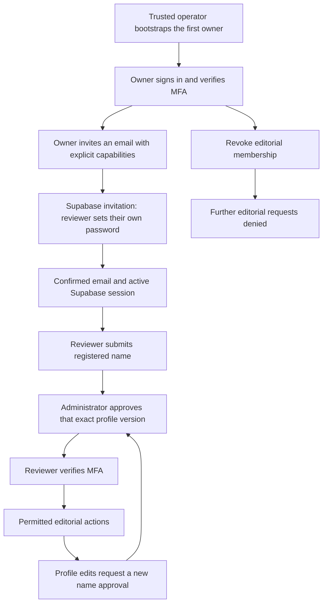

# Reviewer accounts and permissions (#274)

This is the identity foundation for [#263](https://github.com/Coding-Moves/one-concept/issues/263).
It adds private account APIs and an operator bootstrap command. The login,
invitation callback, MFA and profile **screens are delivered in #278**. Do not
enable live invitations until that callback and the Auth sender work in staging.
No mobile update, new paid service or production account is created by this PR.

## Delivery order

| Position | Issue | Result |
| --- | --- | --- |
| 1 | #274 | Invited identities, profiles and server permissions (this change) |
| 2 | #275 | Exact-version approval and reviewer-name snapshots |
| 3 | #276 | Content review/publication API |
| 4 | #277 | Bounded generation and revision queue |
| 5 | #278 | Shared branded website and reviewer screens |
| 6 | #279 | Review deadlines and notification emails |
| 7 | #280 | Published-version attribution in the mobile app |
| 8 | #297 | Private owner reporting and synthetic-data demo |
| 9 | #281 | Hosting, staging rehearsal and production activation |

## Identity and account lifecycle



Faizan's suggestion is supported by separate accounts, first-login name setup,
editable profiles and an expandable team. Three is the initial onboarding target,
not a database limit or three seeded accounts. Passwords remain in Supabase Auth:
the owner never inserts plaintext passwords or sends shared credentials.

Membership is keyed by the signed JWT `sub`. Neither JWT email, editable
`user_metadata`, a submitted name nor a role chosen in the browser grants access.
The API also checks the token's `session_id` against `auth.sessions`, including
ownership and `not_after`, and checks authoritative email confirmation and bans.
Signed JWT expiration, algorithm, issuer and audience checks remain in force.
Supabase-managed Auth tables are read, never altered by the application migration.

`status=active` means membership has not been revoked; it does **not** imply
confirmed email, completed onboarding or MFA. `/me` exposes the onboarding and
MFA state for the future frontend. Users without an approved name cannot exercise
editorial capabilities. All capability checks require a signed `aal2` token.
Reading one's own account and requesting a name change work at `aal1` so a new
reviewer can complete onboarding before privileged actions.

## Permission contract

| Capability | Intended protected operation |
| --- | --- |
| `review` | Read private drafts/review queues (#276) |
| `approve` | Approve an exact content revision (#275/#276) |
| `publish` | Publish an approved revision (#276) |
| `request_generation` | Request bounded AI work (#277) |
| `manage_reviewers` | List/invite reviewers, approve names and change account access |

Capabilities are independent; no role string or implicit administrator shortcut
grants all of them. Bootstrap explicitly grants all five to the owner. The default
invitation grants only `review`. For an **Approve and publish** reviewer, explicitly
grant `review`, `approve` and `publish`; add generation requests only if needed.
Owner reporting/log access in #297 requires its own design and is not granted to
every reviewer by this change.

Future content APIs must call `authorize(..., capability, mutation=True)` within
the same transaction as the protected mutation and retain the transaction lock
until commit. This serializes writes against access changes. For operations
requiring two capabilities, check both while retaining that lock. The current CLI
publication path is unchanged; closing the bypasses across CLI/workers/imports is
part of #275/#276, not a completed claim of this identity PR.

Account writes are versioned and audited. An outdated `expected_version` returns
409 instead of overwriting a newer name, permission or status. A pending name
change keeps the existing approved name until another administrator approves it.
An administrator cannot approve their own name change; bootstrap establishes the
first owner's initial approved name through the trusted operator. Past account
events are retained. Content approval/name snapshots follow in #275; do not use a
live profile join as historical attribution.

## API contract

All routes are below `/v1/editorial`, require a bearer token and return private,
non-cacheable responses. Unknown input fields are rejected. Passwords and client-
asserted approval identities are never accepted. Validation errors omit raw input.

| Method and path | Authority | Input/result |
| --- | --- | --- |
| `GET /me` | Active, confirmed member/session | Member, `onboarding_required`, `name_approval_pending`, `mfa_required` |
| `PATCH /me/profile` | Same, own account only | `expected_version`, `registered_name` |
| `GET /reviewers` | `manage_reviewers`, approved name, MFA | UUID `cursor`, `limit` 1–100 (default 25); `items`, `next_cursor` |
| `POST /reviewers` | Same | `email`, `capabilities`; returns membership, HTTP 201 |
| `PATCH /reviewers/{user_id}/access` | Same | `expected_version`, `status` (`active`/`revoked`), `capabilities` |
| `POST /reviewers/{user_id}/approve-profile` | Same, another account | `expected_version`; approves the stored requested name |

Example invitation JSON (to be submitted by the authenticated owner UI):

```json
{"email":"reviewer@example.invalid","capabilities":["review","approve","publish"]}
```

For a new Auth email, the backend calls Supabase Admin `/invite` with its server
key and a fixed configured callback. For an existing Auth account, the explicit
owner request enrolls that same user ID; it does not send a second invite or
change their password. The user signs in with their existing credentials or uses
normal Auth recovery. Confirmation is still required. The owner UI should explain
this distinction rather than promise an email for every request.

Duplicate membership creation returns 409, including revoked memberships: use
versioned access settings to deliberately reactivate them. Provider failures
return a sanitized 502 and do not create a membership. An ambiguous provider
timeout can leave an Auth account/email without membership. Check Auth delivery
logs before retrying; a retry binds the existing identity without sending another
email. If no invitation arrived, use Supabase's invitation/recovery tools after
checking its status. Never auto-confirm an account to bypass delivery failure.
Invitations are an external side effect and cannot be atomically rolled back with
PostgreSQL; membership remains fail-closed if the later database transaction fails.

Access changes cannot remove the last active, confirmed administrator with an
approved name. This does not protect against out-of-band deletion/bans in Supabase;
keep a second administrator onboarded and MFA-tested before retiring the owner.
Revocation removes editorial access, not the person's separate learner account.
Reactivation restores access for otherwise valid sessions; use Supabase session
revocation/password recovery too when responding to compromised credentials.

## Manual activation: later, first in staging

1. Complete the isolated environment from #255 and the callback/login/MFA screens
   from #278. Keep `EDITORIAL_ENABLED=false` while the foundation alone is deployed.
2. Apply `backend/migrations/0032_editorial_accounts.sql` after the preceding
   migrations. Run the repository's read-only schema verification from the exact
   backend revision. Do not mark `applied.txt` until actual application is verified.
   Merging into `develop` does not apply production SQL. The production schema
   health check requires the new migration before deploying this image to main.
3. The backend database role needs read access to `auth.users` (`id`, `email`,
   `email_confirmed_at`, `banned_until`) and `auth.sessions` (`id`, `user_id`,
   `not_after`), plus its normal application-table access. Verify those permissions
   in staging; never grant Auth-table access to browser roles.
4. Configure the exact website origins in `ALLOWED_ORIGINS`. Do not use `*`.
   Set `EDITORIAL_INVITE_REDIRECT_URL` to the website's HTTPS invitation callback,
   with no arbitrary query redirect or fragment. Its origin must be allowlisted.
   HTTP localhost callbacks are allowed only outside production.
5. Add that exact invitation callback and the frontend's recovery URL to Supabase
   Auth's redirect allowlist. Configure/verify Auth invitation and recovery email
   delivery under #171/#152. A backend `SUPABASE_SERVICE_ROLE_KEY` is required only
   for issuing new invitations; it must never enter `admin/` build variables.
6. Create/invite the initial owner using Supabase's trusted operator tools and
   finish email confirmation. In the backend environment run once:

   ```sh
   python -m app.workers.editorial_accounts --email owner@example.invalid --name "Owner Name"
   ```

   Substitute the actual owner locally; never paste credentials into an issue.
   Bootstrap requires an existing confirmed, unbanned Auth account and refuses to
   run over existing editorial memberships or a retained bootstrap audit record.
   It is not exposed over HTTP.
7. In the staging website, sign in, enroll an authenticator/TOTP factor and finish
   a challenge/verification to obtain `aal2`. Enable `EDITORIAL_ENABLED=true` on
   the staging API. Invite the chosen reviewers, have each set their own password
   and submit a name, then approve the correct profile version. Test a second
   administrator before relying on the final-admin safeguard.
8. Rehearse sign-in, recovery, logout, name editing, MFA, permission denial and
   revocation with isolated accounts. Provider delivery and physical browser
   behavior require this live staging check; unit mocks do not prove delivery.
   Production activation belongs to #281 after the whole workflow is ready.

## Frontend handoff: recovery, logout and session safety (#278)

- Use the existing Supabase Auth client and public key for sign-in, password setup,
  recovery and TOTP enrollment/challenge. Never proxy passwords through these APIs.
- Supabase invitations do not support the usual PKCE invitation flow. Implement
  its supported callback handling, consume the session fragment securely, remove
  credentials from the URL immediately and render only after checking `/me`.
  Do not load analytics or third-party scripts on credential-bearing callbacks.
- Recovery uses `resetPasswordForEmail` with the configured recovery redirect,
  then the authenticated Auth password update. Recovery does not confer editorial
  permissions or replace an MFA challenge.
- Call Supabase `signOut` and clear all editorial account/draft caches on logout
  and account changes. The backend denies tokens whose Auth session has been
  removed even if their JWT expiration has not arrived. A local cache clear alone
  is not server logout. Fence in-flight responses by account and never restore one
  reviewer's private data for another account.
- Handle 401 by returning to sign-in; handle 403 as denied access or required
  profile/MFA setup using `/me`; handle 409 by reloading before resubmission.
  Never keep displaying privileged cached content after revocation.
- If the only owner's MFA device is lost, a trusted Supabase project operator
  verifies identity and follows Supabase Auth's factor recovery/removal procedure;
  the owner enrolls a replacement factor before any privileged action. Do not add
  an unauthenticated recovery/role-grant endpoint or share database credentials.
- Supabase's configurable time-box/inactivity controls can require a paid plan.
  This implementation relies on JWT expiry, session existence/`not_after`, and
  membership checks; it does not claim a free configurable idle-session timeout.

## Rollback and validation

Set `EDITORIAL_ENABLED=false` to deny editorial requests; preserve membership and
audit data. Do not roll back the migration by dropping the tables or weakening
Auth checks. Existing learner registration and endpoints remain independent.

Tests use disposable PostgreSQL 16, locally signed ES256 JWTs and fake HTTP
providers. They exercise team expansion, stale name approvals, metadata forgery,
MFA, bans, revoked/deleted sessions, pagination, concurrent invitations, queued
mutations versus revocation, private storage and sanitized provider failures.
No real email, reviewer account or production database is used by the suite.

Primary references checked for this implementation:
[Supabase sessions](https://supabase.com/docs/guides/auth/sessions),
[MFA](https://supabase.com/docs/guides/auth/auth-mfa),
[invitations](https://supabase.com/docs/reference/python/auth-admin-inviteuserbyemail),
[official Auth adapter](https://github.com/supabase/auth-py/blob/main/supabase_auth/_async/gotrue_admin_api.py).
