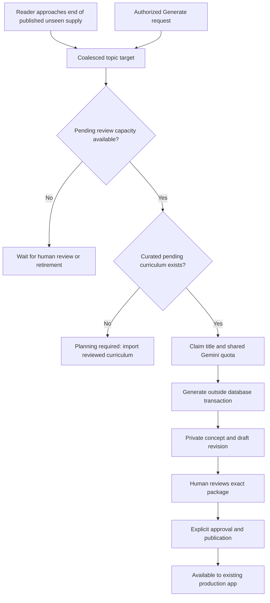
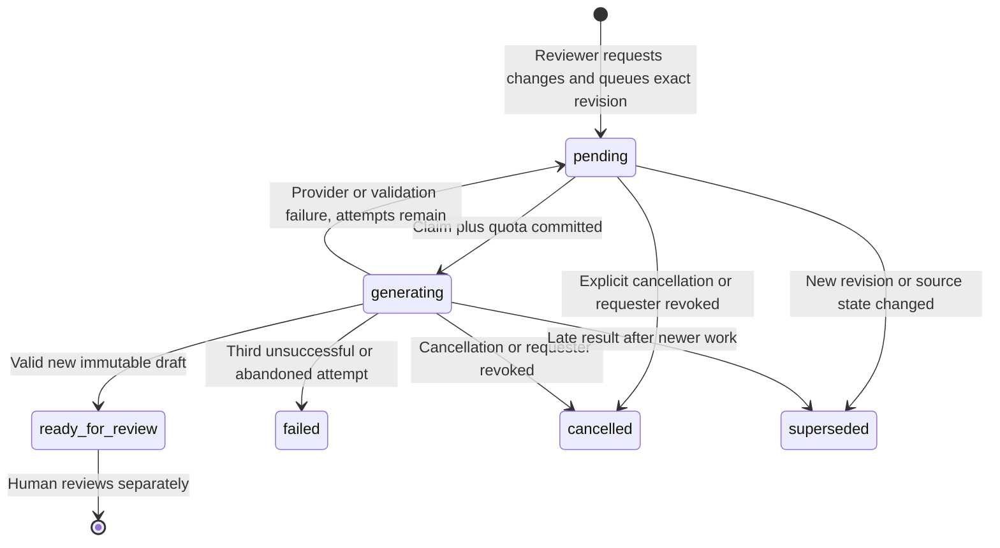

# Bounded editorial generation (#277)

Step 4 of [#263](https://github.com/Coding-Moves/one-concept/issues/263) extends
existing Gemini workers. New lessons and AI corrections stay private until the
exact new revision passes authenticated human approval and publication. A low
stock level, deadline, absent reviewer or provider outage never bypasses that gate.
The website is #278; reviewer email/deadlines and production activation are later
steps. No additional paid provider or scheduled service is introduced here.

## Two paths into review



Demand uses **published, active, unseen lessons** and the reader's assigned
history, not a hard-coded “finished 25” event. It maintains a reserve ahead of
exhaustion. Retired subtopics are excluded from demand and inventory. Scheduled
planning refreshes targets for active readers; repeated requests coalesce.
Published inventory, private drafts and in-flight backlog claims contribute to
meeting a target. A separate human-capacity bound prevents a growing target
from creating unlimited unreviewed content. Selection, daily assignment uniqueness,
learned counts, no-repeat rules and the existing exhaustion/review fallback remain
unchanged. New approved content is data, not a reason for another APK release.

`CONTENT_REVIEW_BACKLOG_LIMIT=25` is the default per-topic ceiling (1–250). It
counts draft concepts and published concepts with open current-version review
work once per concept, plus generating backlog titles. Multiple historical
revisions do not multiply capacity. Claims check this under the same shared
reservation lock as provider capacity; over-cap claims and unspent reservations
roll back together. Rejected draft concepts still occupy capacity until the
reviewer corrects them or a publisher explicitly retires the concept. The
concept `retire` action now accepts drafts as well as published content and
retains all history/evidence. Subject/subtopic retirement also removes inactive
inventory from capacity calculations.

The same limit bounds active AI revision jobs per topic. One request is allowed
per source revision, with at most one active job per concept. This prevents fresh
request IDs from repeatedly spending on identical feedback. A cancelled or
exhausted job requires a newly staged and reviewed revision for another AI request;
never reset the attempt counter or delete evidence to retry.

## AI revision lifecycle



1. Submit a draft through the normal review API, then record a substantive
   `changes_requested` decision. Its immutable event is the feedback source.
2. Request AI revision with the **current revision token**. The authenticated
   actor needs both `review` and `request_generation`, an approved name, current
   confirmed Supabase account/session and MFA. The backend records the original
   full body, exact decision/feedback event and authenticated request audit event.
3. The scheduled worker claims a bounded batch. The job has its own random claim
   token and lifetime attempt count. The shared daily quota and concurrency limit
   include pool top-up, prefetch, legacy rewrite work and these revision jobs.
4. Commit the claim before contacting Gemini. No HTTP request waits for a model,
   and no database connection stays pinned during the provider call. Only the
   lesson package and feedback enter the revision context, not auth credentials,
   member profiles or settings. Configured secrets are redacted from raw lesson,
   feedback, title and taxonomy strings before JSON encoding; audit evidence is
   preserved unchanged.
5. On completion, reacquire account → catalog → job locks and check the claim
   token, current requester access, source state/version/body and complete sibling
   revision inventory. Cancellation, retirement, revoked permissions, publication
   or a newer manual/AI revision makes the output ineligible. A reclaimed worker
   cannot finish another attempt. Late output is discarded.
6. Validate the full `LessonBody`/flashcard/three-MCQ package, taxonomy,
   prerequisites and duplicate checks. Success creates a new immutable **draft**,
   linked to its source and job. It inherits no checklist, reviewer approval or
   published attribution. `ready_for_review` describes the job; the revision is
   still `draft` and needs normal submission and human review.

AI revisions rewrite the summary, example, flashcard and MCQs. The curated title,
subtopic, objective, references and prerequisite plan stay fixed. Use the existing
manual staging endpoint for those changes or if AI is unavailable. No provider
result can edit the source revision. All original comments and decisions remain
available through revision history/timeline; job identifiers connect the exact
source, feedback, request and result.

Authorization is checked again at claim and completion against current membership,
capabilities, approved name, confirmed account and ban status. An accepted job is
durable work: logging out or a short-lived JWT expiring does not cancel it. Explicit
cancellation or removal of the required permissions does. No JWT is stored in a job.

Cancelling a running job immediately makes its output ineligible, but cannot stop
an HTTP request in another worker process. Its provider slot remains reserved
until that worker returns or its 30-minute lease expires. An abandoned cancelled
job is never retried; cleanup only clears its lease. Cancelling a pending job
makes no provider call.

Each failed provider call consumes its shared daily reservation. Revision jobs
allow three attempts total, including throttled and abandoned attempts. Retriable
failures wait at least five minutes **and until a later scheduled worker run**;
there is no extra timer or retry process. Claims older than 30 minutes are reaped
on the next enabled worker run. Quota denial, disabled generation, absent API key
or shared concurrency exhaustion does not start/spend an attempt. Failures expose
only `provider_error`, `rate_limited`, `invalid_output`, `stale_claim` or
`requester_inactive`, never raw provider response text. Fix source/plan problems
with manual staging; do not assume a repeated AI call will fix a prerequisite.

## Private API and operator commands

Use the existing MFA operator client in [editorial-api.md](editorial-api.md).
It supports these routes without another tool or a service-role credential:

| Route under `/v1/editorial` | Contract |
| --- | --- |
| `POST /generation-requests` | `request_generation`; topic/count demand. Bounded by planned work, batch and available review slots. Returns `demand_recorded`, not a generated lesson. |
| `GET /generation-supply/{topic_id}` | `review`; published/draft/pending/generating/failed counts, review load/capacity, target, `review_blocked`, `planning_required` and switch/configuration status. |
| `POST /revisions/{id}/generation-requests` | `review` + `request_generation`; enqueue the exact changes-requested revision. Returns 202 with job ID and `pending`. |
| `GET /generation-jobs` | `review`; bounded pagination (`limit` 1–100, UUID `cursor`), optional `topic_id` and `status`. |
| `GET /generation-jobs/{id}` | `review`; current safe status, retry count, token and source/request/feedback/result identifiers. |
| `POST /generation-jobs/{id}/cancel` | `request_generation`; cancel pending/generating work with its current token. |

Revision requests and cancellation use this shape, with a fresh UUID for a new
operation and the same UUID/body for a retry after a lost response:

```json
{
  "request_id": "YOUR-OPERATION-UUID",
  "expected_token": "CURRENT-64-CHARACTER-RESOURCE-TOKEN",
  "note": "Requesting an AI correction for the recorded review feedback."
}
```

For a revision request the token is from revision detail; for cancellation it is
from job detail. `note` is the request/cancellation explanation; the AI receives
the recorded changes-requested decision as feedback. A receipt replays the
original response after checking current authorization; poll job detail for live
state. Reusing a request ID with different content or a stale token returns 409.
There is no public endpoint, HTML rendering, raw provider diagnostic or arbitrary
URL fetch. Retain private/no-store handling in the future website.

```bash
python -m app.workers.editorial_review \
  --api-url https://your-staging-api.example \
  --path /v1/editorial/revisions/REVISION_UUID/generation-requests \
  --body /tmp/editorial-revision-request.json

python -m app.workers.editorial_review \
  --api-url https://your-staging-api.example \
  --path /v1/editorial/generation-jobs/JOB_UUID
```

## Worker configuration and rollout

No immediate manual production action is needed to review or merge this PR into
`develop`. Before deploying the new backend image in **staging**:

1. Apply `backend/migrations/0035_editorial_generation.sql` after 0034, followed
   by `backend/migrations/0036_editorial_cancelled_leases.sql`, using the normal
   migration runbook. These add private jobs, immutable inputs/results, backlog
   claim tokens and provider leases for cancelled in-flight jobs. They do not
   publish content or grant users access. The forward migration leaves 0035
   unchanged for environments that have already applied it.
2. Use the schema verifier packaged in the new image. Update `applied.txt` only
   after actual production application and verification, never just for CI.
3. Upgrade the API, pool-topup and any rewrite workers together. Pause old
   generation workers and let in-flight work finish before switching versions:
   old workers do not honor the new claim/capacity checks. Do not run mixed images.
4. Keep `EDITORIAL_ENABLED=false` until the identity/MFA foundation and staging
   review flow are configured. Test with a restricted reviewer and mocked provider
   before a deliberately authorized live generation call. New pool drafts remain
   private even with editorial UI access off.
5. Set the same `CONTENT_REVIEW_BACKLOG_LIMIT` (default 25),
   `GENERATION_DAILY_CALL_CAP` and `GENERATION_MAX_CONCURRENT` on API/prefetch,
   pool-topup and maintenance workers. `GENERATION_ENABLED=false` blocks new
   provider work; zero daily cap also blocks new reservations.
6. Keep the existing `python -m app.workers.pool_topup` command and cron schedule.
   Each run processes up to `CONTENT_GENERATION_BATCH` revision jobs, then the
   existing bounded per-topic top-up. Cadence determines revision latency; this
   PR does not change the schedule or promise immediate processing.

The health report adds aggregate `revision_jobs` states and failed/stale revision
conditions; worker logs report a safe batch summary. Worker counters include new
and corrected drafts. Use the private supply endpoint to distinguish missing
curriculum from a full review queue. Review/publish or retire work when full;
import deliberate curriculum when planning is required. Never generate random
unplanned titles or auto-publish to make the counter green.

Production activation, account setup and end-to-end device rehearsal remain #281.
The later dashboard and notification tasks consume these contracts. This backend
change adds no mobile native dependency, APK requirement or new paid service.
