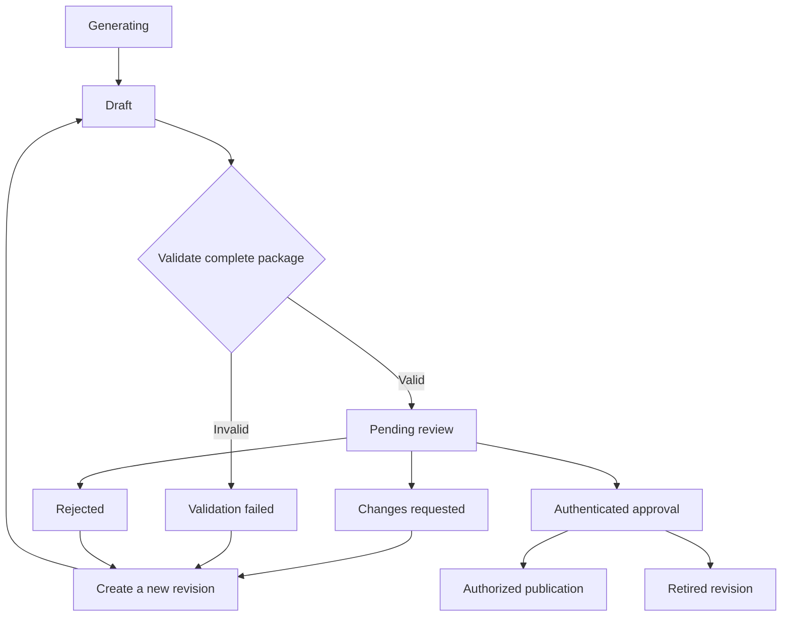

# Exact-revision review and publication

This is step 2 (#275) of #263. It extends the existing content catalog and the
[reviewer identity contract](editorial-accounts.md). The service layer is ready
for the HTTP review routes in #276; no reviewer website or public attribution
field is exposed by this step.

## Data and authority

Migration `0033_editorial_provenance.sql` adds three private tables:

| Table | Purpose |
| --- | --- |
| `editorial_legacy_versions` | One-time snapshot of each version actually published at migration cutover. Includes no reviewer or invented review date. |
| `editorial_revision_events` | Append-only transitions, actor UUID, approved registered-name snapshot, complete revision body, source version/body, note and timestamp. Approvals/attestations also include checklist version 1 and the complete quality results. |
| `editorial_publications` | Exact concept/version and published-body snapshot linked to its authenticated approval or legacy attestation. |

RLS and revoked client privileges keep these records and `concept_revisions`
private. Database triggers reject evidence updates/deletes and edits to a
revision's body, concept or base version after its first review event. Foreign
keys preserve the revision and concept behind evidence. Actor UUIDs deliberately
have no cascading Auth foreign key: deleting an account must not erase history.
Database owners remain trusted operators capable of administering the database.

Free-text `reviewed_by` in old revisions remains historical data. Never use it as
a fallback badge. Renaming a reviewer does not rewrite old attribution. A stored
registered name is attribution, not a claim of government identity verification.

## Lifecycle and transactions

`generating` remains the existing worker claim state. A reviewer with `review`
permission submits a fresh draft using `submit_revision`. Structural failure
records `validation_failed`; it is not proof of factual incorrectness. Success
records `pending_review`; it is not approval. Return the resulting state to the
caller and commit it. Feedback/rejection needs `review`; approval and retirement
need `approve`. Retirement cancels that candidate revision, not the previously
published lesson. Other nonpublished states can also be retired. Corrections to
failed/rejected/requested-change content always use a new immutable revision ID.

`decide_revision` binds approval to the exact revision, base version, source
snapshot, authenticated account, approved name, checklist and substantive note.
The current required package includes summary, example, references, curriculum,
subtopic, model/prompt provenance, one flashcard and exactly three MCQs. Reuse
`LessonBody` and `QualityReview`; automation does not certify factual accuracy.

`publish_revision(session, revision_id, actor, settings)` requires `publish`,
retrieves the stored approval and checks current body/version/taxonomy and
retirement. It reuses existing graph, duplicate and prerequisite validation.
The actor and settings come from verified backend dependencies, never submitted
reviewer IDs/names. No approval name or quality checklist is accepted by the
publication call. Approval and publication are separate permissions; #276 can
compose them into one **Approve and publish** transaction for a dual-role user.

Every operation runs within a caller-owned READ COMMITTED transaction. Acquire
the account lock before the catalog lock, then recheck authorization after both.
Commit the whole operation or roll it back on any exception. No provider I/O
occurs in these services. The application service guards transitions; privileged
database maintenance is not an alternative reviewer interface.

Publication updates the existing concept ID and increments its content version,
then records provenance in the same transaction. Until that commit, the last
published body remains available. Competing approvals/publications serialize;
stale candidates cannot replace a later version. Retrying an already published
revision reports its historical version without republishing it or duplicating
evidence. Permission checks still apply to retries.

`published_provenance` returns evidence only when the requested version and
stored published snapshot match the current published concept. It returns none
for changed/unpublished content and has no historical-name fallback. #280 must
map the safe attribution fields through its API and cache them with the exact
displayed lesson version; this helper is not itself a new mobile API.

## Existing lessons

Only the rows selected as published by migration 0033 are inventoried. No worker
extends that inventory. Drafts, future imports and later versions are never
implicitly grandfathered. The migration changes no lesson ID/body, assignment,
completion, save or streak. Existing content remains available without a badge.

`attest_legacy_version` requires both `approve` and `publish`, an exact match to
the inventoried current version, the complete current package and checklist,
and a substantive note. It records attribution without changing the lesson or
incrementing its version. Incomplete legacy packages require a reviewed
correction; do not fabricate missing references, flashcards or quiz answers to
make attestation pass. A version can receive only one publication/attestation
record. A later correction creates its own approval and version evidence.

Learner detail, selection, saved/history, current state and review reads exclude
unpublished concepts. Quiz candidate queries already require published content.
The collection filters run before pagination, including when an old/imported
interaction references a draft. Quiz snapshots created from previously
published lessons retain their frozen text; a pending correction does not
replace them.

Hiding a lesson does not erase a completed learning day: aggregate counts and
streaks still use the retained completion records. History pagination uses only
visible lessons, so hidden rows do not create empty cursors. An existing daily
assignment or review still owns that day's slot after its lesson is retired.
The daily endpoint returns the existing `exhausted` response without content
instead of assigning a second activity; the following day selects normally.

## Rollout and operational boundary

1. Keep production editorial activation disabled while #276–#281 are completed.
2. Apply 0032 then 0033 in staging after the preceding migrations. Pause catalog
   publication/import writers during cutover; normal learner reads may continue.
3. Verify the schema contract, inventory count/versions and unchanged learner
   records. Do not bulk insert invented approval identities. Add 0033 to the
   production applied ledger only after actual production application is verified.
4. Deploy compatible API/worker code together during the coordinated rollout.
   The old `content publish/reject --reviewed-by ...` commands now fail closed:
   a typed name cannot satisfy authenticated review. Reports, imports, draft
   staging and generation remain available. Authenticated HTTP/CLI entry points
   are #276; do not deploy this intermediate workflow as a complete review UI.
5. Rehearse submit, feedback/new revision, approval, publication, stale retry,
   unchanged legacy attestation, revocation and learner visibility before #281.

There is no production migration, real account invitation or content publication
performed by this PR. No mobile/native dependency, APK or OTA is required for
these backend changes. Once the full workflow is deployed, publishing compatible
content is a database operation; each lesson does not need a release PR.

If rollout fails, disable editorial operations and retain existing published
content/evidence. Do not downgrade to a free-text publication writer or delete
the audit tables to make old code work. Restore the known-good compatible
backend or complete the additive fix before restarting publication.
