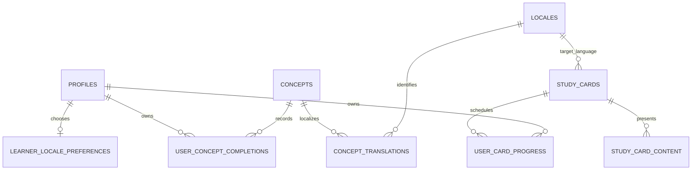

# Multilingual content architecture

> Status: future-work design for [#265](https://github.com/Coding-Moves/one-concept/issues/265). This document creates no database table, translation, user preference, release, or deployment.

One Concept will support learners reading the same lesson in their preferred
language without creating duplicate learning identities. It will later support
structured language-learning cards and games using the same durable foundations.

## The essential distinction

There are two related but different products:

1. **Localized One Concept lessons.** “Recursion” remains one canonical technical
   concept whether a learner reads it in English, Urdu, Arabic, Spanish, Chinese,
   Japanese, or Russian. Completion, history, streaks, achievements, and
   analytics belong to the canonical concept.
2. **Language-learning courses.** A Spanish vocabulary item such as `hola → hello`
   is a distinct study card with its own stable identity, answer rules and future
   game progress. It is not a translation of the technical concept “Recursion.”

The first product is the scope of #265. The second is a follow-on delivery that
must reuse the locale and publication model but have its own focused issue and
PR.

## Future data model



### Canonical concepts

The existing `concepts` row remains the only identity for a lesson. It keeps its
UUID, slug, topic, subtopic, curriculum, content-version lineage, assignment,
completion, saved/history, review, achievement, and analytics relationships.

Translations must never receive their own concept UUID, daily assignment, or
completion record. A learner who completes the Arabic version of a concept has
completed the same canonical concept as a learner who completes the English
version.

### Locales and learner preference

A future `locales` registry should use BCP 47 language tags, for example:

| Locale | Direction | Initial purpose |
| --- | --- | --- |
| `en` | LTR | Canonical fallback and current source language |
| `ur` | RTL | First localized lesson pilot |
| `ar` | RTL | Second RTL pilot after layout validation |
| `es` | LTR | Latin-script language pack |
| `zh-Hans` | LTR | Simplified Chinese language pack |
| `ja` | LTR | Japanese language pack |
| `ru` | LTR | Cyrillic language pack |

A `learner_locale_preferences` record should contain the account UUID,
preferred locale and a validated fallback locale. The server, not the mobile
client, decides which reviewed locale variant is returned. A profile setting may
change the preference, but it must not rewrite historical progress.

### Concept translations

A future `concept_translations` row should be unique by canonical concept,
locale, and source concept version. It needs its own draft/review/published
status, reviewer provenance, review note, timestamps, and source version.

The localized payload must include every learner-visible field as one reviewed
unit:

- daily digest title, summary, body, examples, and labels;
- flashcard front and back;
- multiple-choice question text, choices, correct answer position, and answer
  explanation;
- accessibility copy and any locale-specific typography/direction metadata.

The translation must be tied to the exact canonical source version. When an
English lesson is revised, an older published translation may remain available
only when it explicitly references the reviewed source version it represents.
A changed claim, example, flashcard, or answer key creates a new translation
draft; it must not silently inherit “published” status.

## Serving one coherent language

The daily, flashcard, detail, review, and quiz APIs should resolve a complete
localized payload once, at the server boundary:

```text
Requested locale
      │
      ├─ reviewed translation for the canonical version → return it
      ├─ reviewed configured fallback translation       → return fallback
      └─ neither exists                                 → do not assign/serve it
```

A response must include `canonical_concept_id`, `served_locale`,
`requested_locale`, and `is_fallback`. The mobile app can explain a fallback
briefly and offer a preference change, but it must not compose fields from
several languages. There must be no English question with Japanese choices or
Arabic flashcard beside an English explanation.

Daily selection must choose only concepts that have a complete reviewed payload
in the requested locale or its declared fallback. It must preserve the existing
one assignment per account/day and no-repeat canonical-concept constraints.
Review, history, saved, offline cache, quiz snapshot, analytics, achievements,
and subtopic completion all remain keyed by the canonical concept UUID.

## Editorial workflow

Translation follows the existing human publication gate:

1. A maintainer creates a draft from an exact source concept version.
2. A translator or AI may supply a draft, references, terminology notes, and
   locale-specific examples.
3. A qualified reviewer checks meaning, safety, terminology, readability,
   examples, flashcard recall value, every answer option, correct answer, and
   explanation.
4. The reviewer publishes the whole localized payload atomically or returns it
   for revision. Partial payloads stay draft-only.
5. Publication and withdrawal are audited without modifying previous reviewed
   versions.

AI translation is useful for drafting but is never a production publication
path. The operational report should show draft/review backlog by locale without
exposing learner data or raw provider diagnostics.

## Future study cards and games

Language courses need a small, reusable card model rather than storing game
copies inside translated lesson JSON.

A future `study_cards` row should have a stable UUID, course/level, card type
(`vocabulary`, `phrase`, or `grammar`), target locale, difficulty, durable
semantic key, and active state. `study_card_content` should hold reviewed
front/back text, pronunciation, optional transliteration, hints, source notes,
and accepted answer variants. Answer normalization must be locale-aware; for
example, it must not treat Arabic diacritics, Japanese scripts, or Chinese
character variants as accidental wrong answers.

`user_card_progress` should remain separate from concept completion. It can later
hold due time, interval, ease, attempts, correct answers, and last interaction.
A future matching, listening, typing, recall, or multiple-choice game reads and
writes the same card/progress records. Games must not create duplicate cards or
count a card as a technical concept.

Begin each language with a small human-reviewed foundation pack instead of a
large unreviewed import: useful vocabulary, phrases, and basic grammar cards.
The game UI and spaced-repetition policy should follow only after card identity,
review, answer handling, and progression rules are stable.

## Delivery plan

### Phase 1 — localization foundation (#265 implementation)

- Add immutable migrations for locale registry, preferences, translation
  versions and publication provenance.
- Add server locale resolution and complete-payload fallback rules.
- Extend daily/detail/review/flashcard/quiz responses with a resolved localized
  payload while retaining canonical IDs.
- Add a Profile language setting and safe fallback notice.
- Seed only reviewed pilot content; do not bulk-generate production translations.
- Test account ownership, RTL layout, CJK text wrapping, fallback, no mixed
  payloads, canonical completion and canonical analytics.

### Phase 2 — additional reviewed language packs

Pilot English and Urdu first. Validate right-to-left layout, system font support,
line wrapping, screen-reader reading order, flashcard direction, and quiz option
selection. Add Arabic after the RTL pilot; then Spanish, Simplified Chinese,
Japanese, and Russian as separately reviewed packs.

### Phase 3 — language-learning courses and games

Create the dedicated study-card schema and an initial reviewed course pack.
Introduce one game mode at a time, with account-owned progress and no impact on
the technical-concept daily assignment contract. Add spaced repetition only with
explicit scheduling, reset, retention, and analytics rules.

## Non-negotiable safeguards

- Keep API keys, database credentials, and editorial tools on the backend.
- Store no translation or game progress in a mobile-only counter.
- Do not change already-applied migrations; add a new ordered migration.
- Do not put unreviewed or partial translations into fallback selection.
- Do not duplicate canonical concept completion, analytics, achievements, or
  history by locale.
- Keep every asynchronous client request and cache account-fenced across
  sign-out/account changes.
- Require physical Android testing for RTL, Arabic/Urdu shaping, Japanese,
  Chinese, Cyrillic, accessibility font scaling, TalkBack, and offline fallback
  before a release.

## Decisions needed before implementation

1. Which pilot learner language comes first after English: Urdu or Arabic?
2. Is English always the fallback, or may some locales use another reviewed
   fallback?
3. Who performs translation review for each supported language?
4. Which source content is eligible for the pilot: a small reviewed subset or
   the complete catalog?
5. Should vocabulary-course progress appear beside technical learning analytics,
   or in a clearly separate language-course section?

Until these are decided, this document is the authoritative future-work design;
it intentionally changes no runtime behavior.
