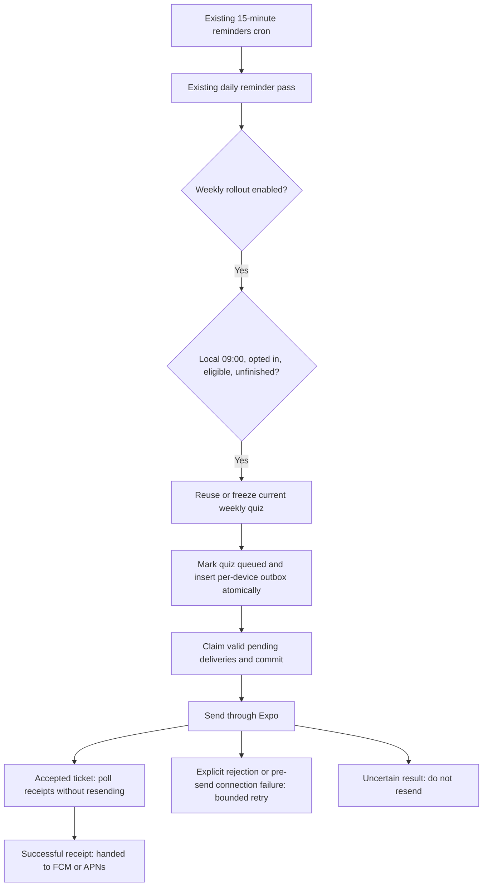

# Weekly quiz availability notifications

Issue [#268](https://github.com/Coding-Moves/one-concept/issues/268) adds optional
push alerts using the existing Expo registration and Railway reminders worker.
No additional paid service, API key, native dependency or background mobile task
is introduced. Deploying this code does not turn the feature on.

## Learner experience

- Profile → **Notifications** is the existing master switch. Its daily reminder
  times and daily sending limits are unchanged.
- **Weekly quiz ready** is a separate opt-in, off for existing and new accounts.
  Turning the master switch off silences both types while retaining the weekly
  preference. Older mobile clients that omit the new field preserve its value.
- At 09:00 in the learner's saved IANA timezone, an eligible unfinished weekly
  quiz may receive one availability alert per registered device. The normal
  15-minute cron window is 09:00 inclusive to 09:15 exclusive. Later eligibility
  is evaluated the next morning; this is not an immediate completion alert.
- Eligibility uses the existing quiz selector: seven distinct completed concepts
  with published reviewed MCQs, or an existing frozen quiz. It never calls Gemini.
- Any submitted attempt counts as completed for notification suppression,
  regardless of score. Optional reattempts remain available in the app.
- Quiz identity retains the existing shared ISO week; notification timing uses
  the profile timezone. Changing timezone does not create another quiz or clear
  its notification history. A local Monday before the UTC week rolls over still
  belongs to the previous quiz week, consistently with the existing quiz API.
- Tapping an alert opens the signed-in account's **Quiz** tab and fetches its
  current quiz. An expired alert opens the current week; an account change never
  uses a quiz belonging to the previous account. Signed-out users sign in first.
  An offline fetch shows the existing retry state. No payload URL is executed.
- Native cold-start and warm taps use Expo SDK 57 response APIs. Web remains a
  settings/quiz fallback, not a browser push implementation.

## Delivery and persistence



`weekly_quizzes.notification_queued_at` and the unique `(quiz_id,
expo_push_token)` constraint prevent recreating notifications for a quiz.
Snapshot/queue creation takes the existing profile lock. Outbox claims use
`FOR UPDATE SKIP LOCKED` and are committed before any HTTP request, so concurrent
workers cannot own the same delivery. Before claiming, the worker rechecks
preferences, completion, week and current device ownership.

| State | Meaning / next action |
| --- | --- |
| `pending` | Queued, not yet claimed. |
| `sending` | Claimed before HTTP. A crash leaves it here; it is never automatically replayed. |
| `accepted` | Expo accepted the ticket. Poll its receipt; do not resend a successful message. |
| `retry` | Confirmed non-acceptance: retry after backoff and eligibility recheck. |
| `failed` | Permanent rejection or retry limit reached. |
| `unknown` | Acceptance cannot be determined; automatic resend is suppressed. |
| `skipped` | Preference disabled, completed quiz, expired week or device moved/removed. |

Only connect/pool timeouts before submission, connection failure, HTTP 429 and
explicit `MessageRateExceeded` rejections are retried. There are at most three
send attempts. Backoff is 15 minutes after attempt one and 30 after attempt two;
cron execution can delay them further. Retries run only from 09:00 to 20:00
exclusive in the profile timezone and in the original quiz week. Once queued,
turning preferences off and later on does not schedule a second announcement.

Read/write timeouts, 5xx responses, malformed or incomplete ticket arrays are
ambiguous and are not replayed. An individual success ticket without a bounded,
nonempty printable ASCII ID is also unknown; it cannot roll back valid peer
results or inflate the accepted count. A crash between claim and result persistence can
therefore miss an alert. This deliberately favors avoiding duplicate successful
submissions. Expo itself is best effort; neither this worker nor Expo can promise
exactly-once handset display. Ticket acceptance is not proof of device delivery.
A receipt confirms handoff to APNs/FCM, not whether the person saw the alert.

Receipt lookups start after the attempt backoff, then every 15 minutes. Successful
receipts stop polling. Unresolved receipts expire after 24 hours. Invalid tokens
are removed only if they still belong to the quiz owner. A successful peer device
is never replayed because another device failed. Tokens and ticket identifiers
remain backend-only under RLS; logs expose counts, not tokens or user records.

Each pass walks all due users in pages of 100, retaining bounded candidate memory
without postponing later pages to another day. Profile-lock rechecks and unique
queue markers still prevent duplicate work when workers overlap. Each pass sends
at most 100 device deliveries and checks at most 100 receipts; queued deliveries
drain during local daytime. Monitor queue age and worker duration before a larger
rollout and adjust sending capacity if it cannot drain within the quiz week. Missed cron
windows do not produce an immediate late-night catch-up notification. Preferences
or quiz completion changed after a committed claim cannot recall an in-flight push.

## Production rollout — owner actions after review

This PR targets `develop`, not a production release. No production setting or
migration is changed by the PR task. Complete staging checks before activation.

1. Apply the repository migrations in order through
   [`0031_weekly_quiz_notifications.sql`](../backend/migrations/0031_weekly_quiz_notifications.sql)
   in the normal protected migration process. Include pending predecessor
   migrations; do not run only 0031 against a database missing weekly quizzes.
   Never add an entry to `backend/migrations/applied.txt` until production
   application and schema verification have actually succeeded.
2. Deploy the API and **reminders** worker from the reviewed release revision.
   Keep `WEEKLY_QUIZ_NOTIFICATIONS_ENABLED=false` (the default). The API reads the
   new preference column even while worker delivery is disabled, so schema goes
   first. No change to `pool-topup`, generation flags or API keys is required.
3. Publish/test the compatible mobile update through the normal release process.
   This change is JavaScript-only, uses the installed notification module and
   leaves the version/runtime unchanged. A release still needs its normal version
   and What's New preparation; a feature PR does not publish an OTA automatically.
4. On the staging reminders service, set
   `WEEKLY_QUIZ_NOTIFICATIONS_ENABLED=true`. Keep start command
   `python -m app.workers.reminders` and cron `*/15 * * * *`. Use a separate test
   database and consenting test devices; never copy production push tokens into
   staging or run the send function against production as a test.
5. Complete the phone acceptance checks below. Then enable the same flag only on
   the production **reminders** service. User opt-in and OS permission are still
   required. Do not enable a second reminders service for the same database.
6. Check normal worker logs and aggregate outbox status. To pause weekly delivery,
   set the flag back to `false`; daily reminders keep their existing behavior.
   Preserve the migration and outbox when rolling back application code. Do not
   clear queued markers or reset ambiguous records to pending to force a resend.

Read-only schema verification (no credentials or personal records):

```sql
select column_name, data_type, column_default
from information_schema.columns
where table_schema = 'public'
  and ((table_name = 'notification_preferences' and column_name = 'weekly_quiz_enabled')
    or (table_name = 'weekly_quizzes' and column_name = 'notification_queued_at'));
select to_regclass('public.weekly_quiz_notifications') as delivery_table;
select relrowsecurity
from pg_class where oid = 'public.weekly_quiz_notifications'::regclass;
select status, count(*) from public.weekly_quiz_notifications group by status;
```

Expect two column rows, the delivery table name, and `relrowsecurity=true`.
An empty status result is normal before opt-in deliveries begin. There is no
reason to share a complete production schema dump or any secret value.

## Validation and physical-phone acceptance

Automated coverage uses disposable PostgreSQL and mocked Expo transport:
local time/DST, opt-out and eligibility, completed quizzes, per-week/per-device
idempotency, concurrent claims, crash suppression, partial failures, retries,
receipt outcomes, token reassignment, RLS and older-client preference updates.
The existing daily reminder suite must pass unchanged. Mobile unit tests cover
allowlisted payloads, duplicate responses and account cleanup. The profile
browser test checks both themes at 320px, failed saves and master-switch behavior.

Before activation, the owner should use a production-like **staging APK** with
push credentials and two consenting test accounts/devices:

- Opt in, grant OS permission, and check that the saved learning timezone is
  correct. Verify initial availability during its normal 09:00 window.
- Tap with the app foregrounded, backgrounded and fully closed. Each opens Quiz;
  duplicate response events do not reopen it. Test an older-week alert as well.
- Sign out before tapping, then sign in with a different test account. Only that
  account's current quiz or eligibility state should appear.
- Submit the weekly quiz before the next due window: no availability alert.
  Disable either preference: no new alert. Daily reminders retain their schedule.
- Re-run the worker with the same quiz and inspect counts: no second successful
  submission. Register a second test device and verify per-device behavior.
- Check denied OS permission, offline tap/retry, screen-reader labels and larger
  system text. Browser tests do not prove native receipt, sound or tray behavior.

## Sources used for this implementation

- [Expo SDK 57 notifications](https://docs.expo.dev/versions/v57.0.0/sdk/notifications/):
  last-response and response-listener APIs, platform behavior and channels.
- [Expo push sending and receipts](https://docs.expo.dev/push-notifications/sending-notifications/):
  batches, tickets, provider receipts, retryable errors and delivery limitations.
- Existing repository [`reminders.py`](../backend/app/services/reminders.py) and
  [`weekly_quizzes.py`](../backend/app/services/weekly_quizzes.py): daily policy,
  verified identity, frozen quizzes and the shared week boundary.
